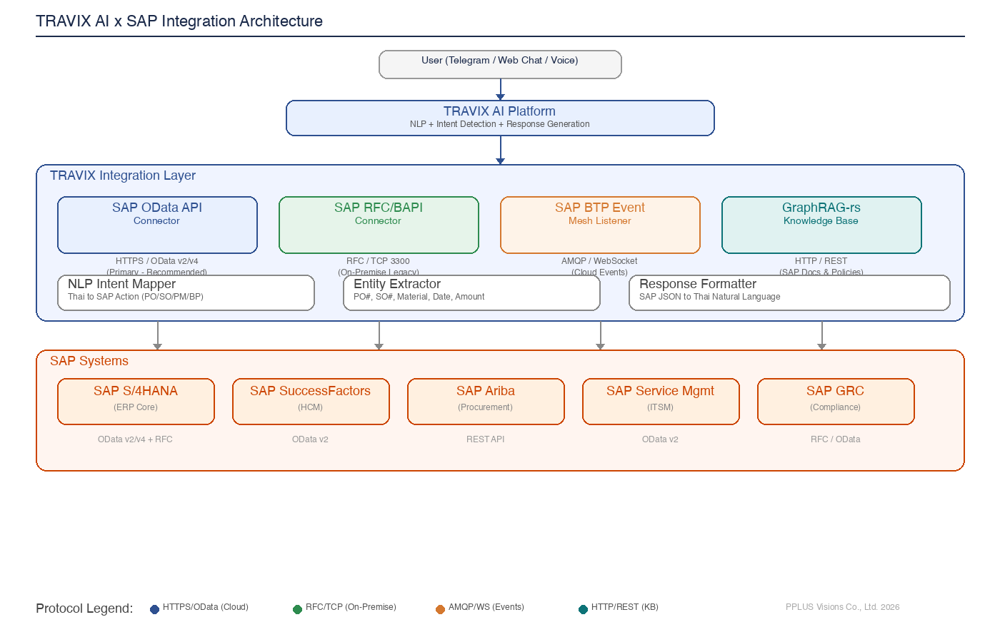

# 🤖 AI Operating System with RAG & Knowledge Graph Workshop

**Workshop 3 วัน — สร้างระบบ AI จริงด้วย Open-Source Stack**

[](https://opensource.org/licenses/MIT)
[](https://www.python.org/downloads/)
[](https://ollama.ai)

---

## 📖 ภาพรวม

Workshop 3 วัน สำหรับ Developer และ IT Professional ที่ต้องการเรียนรู้การสร้าง **AI Operating System** ที่ใช้ RAG (Retrieval-Augmented Generation) และ Knowledge Graph ในองค์กร

> Based on **production system** at **PPLUS Visions Co., Ltd.** — a real Enterprise AI deployment serving 50+ employees.



---

## ✨ จุดเด่น

- 🏠 **Local-First**: ทุกอย่างรันบนเครื่องของคุณ ไม่ต้องส่งข้อมูลขึ้น Cloud
- 🇹🇭 **รองรับภาษาไทย**: ตั้งแต่ Tokenization, Embedding, จนถึง LLM
- 🧠 **Knowledge Graph**: ไม่ใช่แค่ Vector Search — เข้าใจความสัมพันธ์ของข้อมูล
- 🤖 **AI Agent**: สร้าง Agent ที่ตอบคำถามจากฐานข้อมูลองค์กรได้จริง
- 🔧 **Production-Ready**: ใช้ Architecture เดียวกับระบบจริงที่ให้บริการอยู่

---

## 🛠️ Tech Stack

| Component | Tool | Description |
|-----------|------|-------------|
| LLM | Ollama (Qwen3/ThaiLLM) | Local LLM, no API key needed |
| Embedding | bge-m3 / nomic-embed-text | Multilingual embeddings |
| Vector DB | Qdrant | High-performance vector search |
| Knowledge Graph | Neo4j | Graph database for entity relations |
| RAG Engine | GraphRAG-rs | Rust-based hybrid search (vector + graph) |
| AI OS | OpenClaw | Multi-agent orchestration platform |
| Document Processing | Python (PyThaiNLP, LangChain) | Thai NLP pipeline |

---

## 📅 เนื้อหาแต่ละวัน

### 🗓️ Day 1: Data Engineering & RAG Foundation
> วิศวกรรมข้อมูลและพื้นฐาน RAG

| Section | เนื้อหา |
|---------|--------|
| 1.1 | Document Processing — อ่าน PDF/DOCX, extract text |
| 1.2 | Thai NLP — ตัดคำ, Tokenization (PyThaiNLP, newmm) |
| 1.3 | Chunking Strategies — Fixed, Recursive, Semantic chunking |
| 1.4 | Embedding — bge-m3 multilingual, nomic-embed-text |
| 1.5 | Vector Database — Qdrant setup, indexing, search |
| 1.6 | Hybrid Search — Dense + Sparse + Reranking |
| 1.7 | Basic RAG Pipeline — Query → Retrieve → Generate |

📝 **Exercise:** สร้าง RAG pipeline สำหรับ Employee Handbook ภาษาไทย

---

### 🗓️ Day 2: Knowledge Graph & Advanced RAG
> Knowledge Graph และ RAG ขั้นสูง

| Section | เนื้อหา |
|---------|--------|
| 2.1 | Knowledge Graph Basics — Nodes, Edges, Properties |
| 2.2 | Entity Extraction — ดึง entities จากเอกสาร (NER + LLM) |
| 2.3 | Graph Construction — สร้าง Knowledge Graph จาก entities |
| 2.4 | Neo4j — Setup, Cypher queries, visualization |
| 2.5 | GraphRAG — Combining Vector Search + Graph Traversal |
| 2.6 | GraphRAG-rs — Production-grade hybrid search engine |
| 2.7 | Advanced Retrieval — Multi-hop reasoning, graph-enhanced context |

📝 **Exercise:** สร้าง Knowledge Graph จากเอกสารบริษัท แล้วทำ GraphRAG query

---

### 🗓️ Day 3: AI Agents & AI Operating System
> AI Agent และระบบ AI OS

| Section | เนื้อหา |
|---------|--------|
| 3.1 | AI Agent Architecture — Intent, Tools, Memory, Planning |
| 3.2 | Tool-Use Agents — Function calling with Ollama |
| 3.3 | RAG Agent — Agent + Knowledge Base retrieval |
| 3.4 | Multi-Agent Systems — Orchestration, delegation, routing |
| 3.5 | AI Operating System — OpenClaw concepts, heartbeats, skills |
| 3.6 | Evaluation — RAGAS metrics, LLM-as-Judge |
| 3.7 | Capstone Project — Build your own Enterprise AI Assistant |

📝 **Exercise:** สร้าง AI Agent ที่ตอบคำถาม HR จาก Knowledge Base + Knowledge Graph

---

## 💻 สิ่งที่ต้องเตรียม

### Hardware
- Mac / Linux / Windows (WSL2)
- RAM 16GB+ (recommended 32GB+)
- Storage 50GB+ free

### Software
- [Docker Desktop](https://www.docker.com/products/docker-desktop/)
- [Python 3.10+](https://www.python.org/)
- [Ollama](https://ollama.ai)
- [Git](https://git-scm.com)

---

## 🚀 วิธีติดตั้ง

```bash
# 1. Clone repository
git clone https://github.com/Anirach/ai-os-rag-workshop.git
cd ai-os-rag-workshop

# 2. Setup environment (Ollama models + Docker services + Python deps)
bash scripts/setup_environment.sh

# 3. ทดสอบ connections
python scripts/test_connection.py
```

---

## 📁 โครงสร้างไฟล์

```
ai-os-rag-workshop/
├── README.md
├── requirements.txt
├── assets/
│   └── architecture.png
├── day1/                          # Data Engineering & RAG Foundation
│   ├── README.md
│   ├── day1_data_engineering.ipynb
│   ├── day1_exercises.ipynb
│   └── sample_data/
├── day2/                          # Knowledge Graph & Advanced RAG
│   ├── README.md
│   ├── day2_rag_knowledge_graph.ipynb
│   └── day2_exercises.ipynb
├── day3/                          # AI Agents & AI OS
│   ├── README.md
│   ├── day3_ai_agents_evaluation.ipynb
│   └── day3_exercises.ipynb
└── scripts/
    ├── setup_environment.sh
    ├── start_services.sh
    └── test_connection.py
```

---

## 🏢 เกี่ยวกับ PPLUS

Workshop นี้ based on production system ที่ PPLUS Visions Co., Ltd. ใช้งานจริง:

- **GraphRAG-rs** — Semantic search engine with 1,728 chunks จาก 40 documents
- **OpenClaw** — Multi-agent AI Operating System (HR, Finance, Sales, Engineering modes)
- **Ollama + Qwen3** — Local LLM serving ด้วย Thai language support
- **Neo4j** — Knowledge Graph สำหรับ entity relationships ในองค์กร

---

## 📜 License

MIT License — ใช้ได้ฟรี ไม่ต้องขออนุญาต

---

## 🤝 Contributors

- PPLUS Visions Co., Ltd. — Production system reference
- Workshop materials สร้างจากประสบการณ์จริงในการ deploy Enterprise AI
